# CI-CD-Mastery

## Introduction

This project focuses on implementing a CI/CD pipeline to automate the deployment of an e-commerce website. Using Jenkin to ensures continuous integration, continuous deployment, scalability, and reliability of the application. The goal is to simplify the deployment process and enhance the efficiency of software delivery.

## Project Instruction

A technology consulting firm is transitioning to cloud-based architecture for its applications. As a **DevOps Engineer**,I have been assign to design and implement a CI/CD pipeline using Jenkins to automate the deployment process. This includes integrating version control, building, testing, and deploying the application like **Jenkins, Docker, Github,AWS EC2 and Bash Scripting** while ensuring scalability and reliability.

**Note:** For this project, I am using Git Bash on a Windows workstation to execute these shell commands, as it provides a Unix-like command-line experience.

## Project Setup

## Step 1: Jenkins server installation

### Objective: Configure Jenkins for CI/CD automation.

### Step 1.1: Run each of this command

**Update and install Java and Jenkins**
```
sudo apt update
sudo apt install openjdk-17-jdk -y
java -version
wget -q -O - https://pkg.jenkins.io/debian-stable/jenkins.io.key | sudo apt-key add -
sudo sh -c 'echo deb http://pkg.jenkins.io/debian-stable binary/ > /etc/apt/sources.list.d/jenkins.list'
sudo apt update
sudo apt install jenkins -y
```

**start and check Jenkins status**
```
sudo systemctl start jenkins
sudo systemctl status jenkins
```

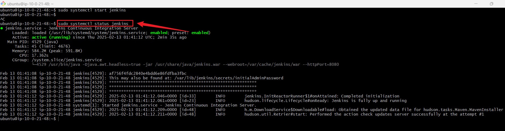

### Step 1.2: Access Jenkins

**Initial Admin Password**
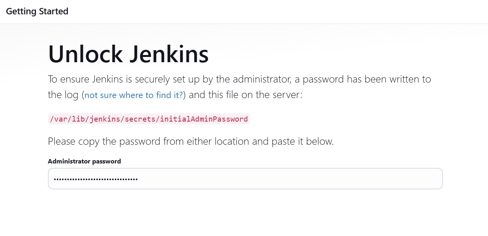

**Installed Suggested Plugins**
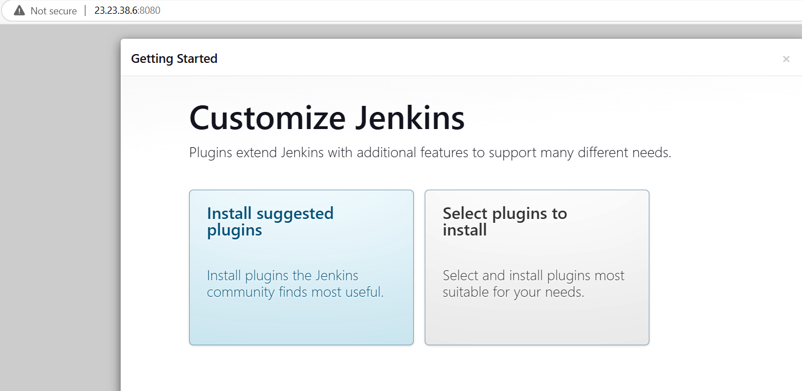

**Created First Admin Credentials**
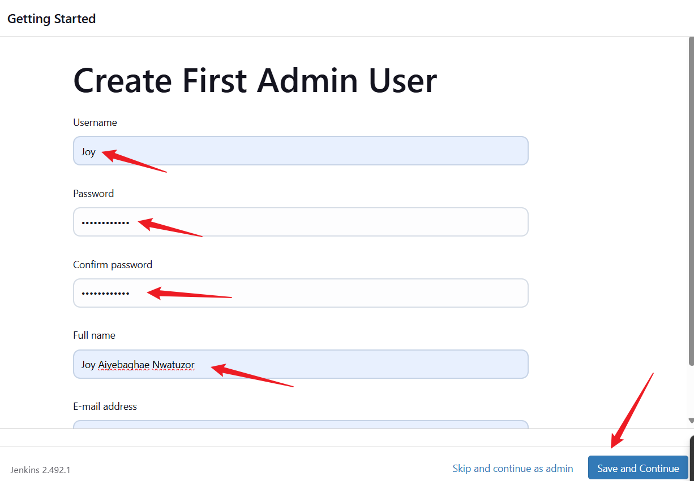

**Jenkins Dashbord**
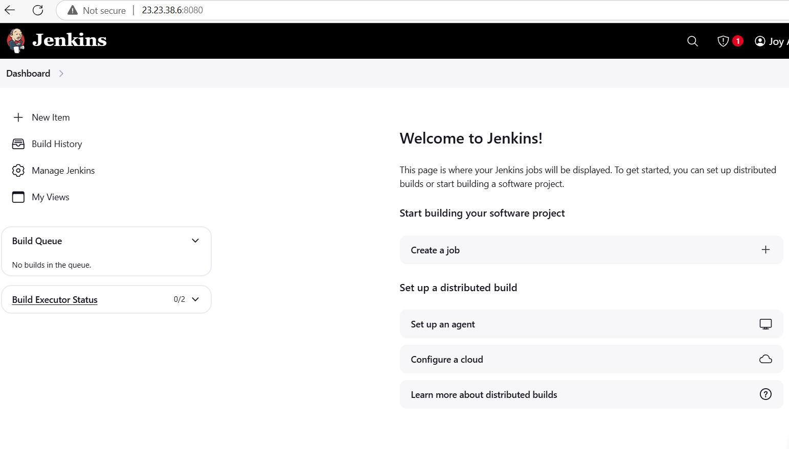

### Security Measures Were Put In Place: 

Install plugins like Role-based Authorization Strategy for access control.
Set up firewall rules properly (avoid open ports to the world).
Enable authentication for builds.


## Step 2: Source Code Management Repository Integration

+ Install Git Plugin


+ Install Docker
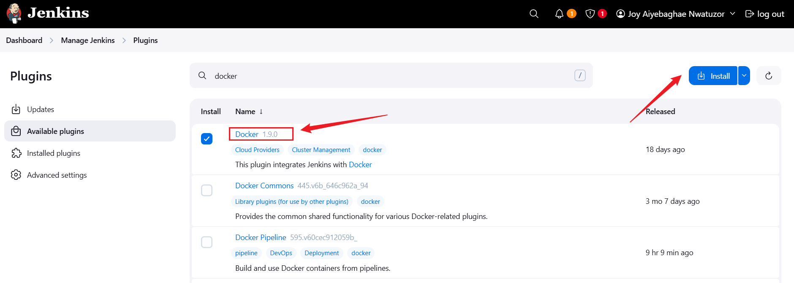


## Step 2: Create Repository on Github

+ Create a repository on Github and name it **CI/CD-Mastery**

+ Initialize it with a README.md file.

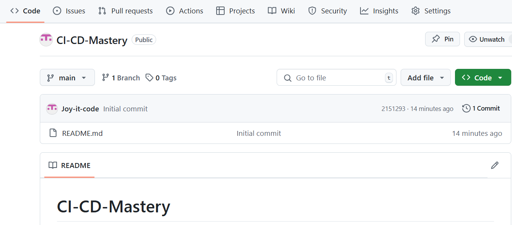

### Step 2.1:Install Git On EC2 instance

**Command**
```
sudo apt install -y git
```
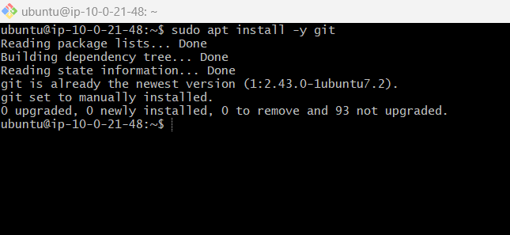


 + Clone the Repository to Your Local Machine

**Command:**
```
git clone https://github.com/Joy-it-code/CI-CD-Mastery.git
```
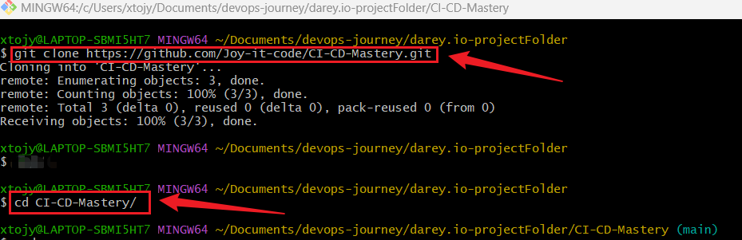

+ Configure Webhook in Github to trigger an automatic build.

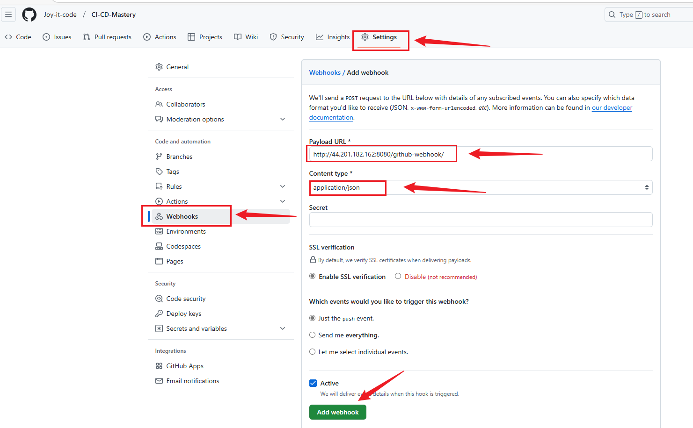


## Step 3: Jenkins Freestyle Jobs for Build and Unit Tests

### Objective: Create a Jenkins Freestyle job for building the application and running unit tests.

**Instructions:**
  
1. Login to Jenkins → New Item → Freestyle Project.
2. Name it **Build and Test Job**.
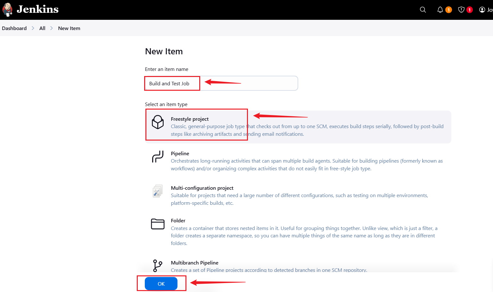

3. Select **Git** under **Source Code Management** and provide the repository URL.
```
https://github.com/Joy-it-code/CI-CD-Mastery.git
```
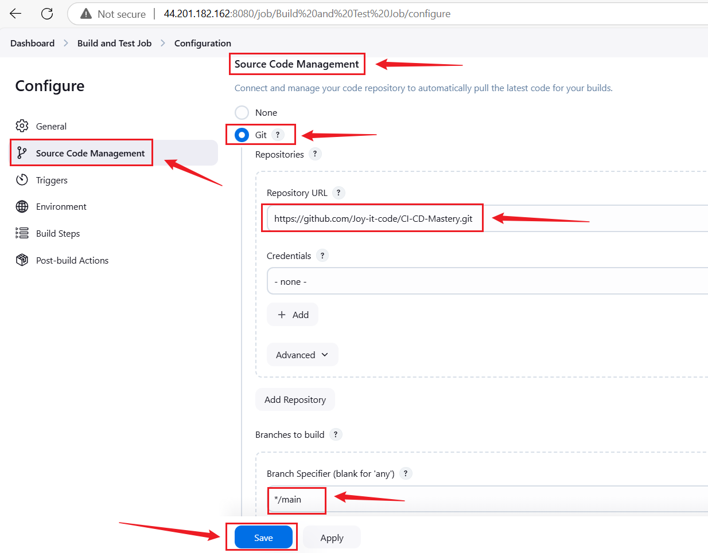

4. Under trigger, enable trigger for GITScm polling.
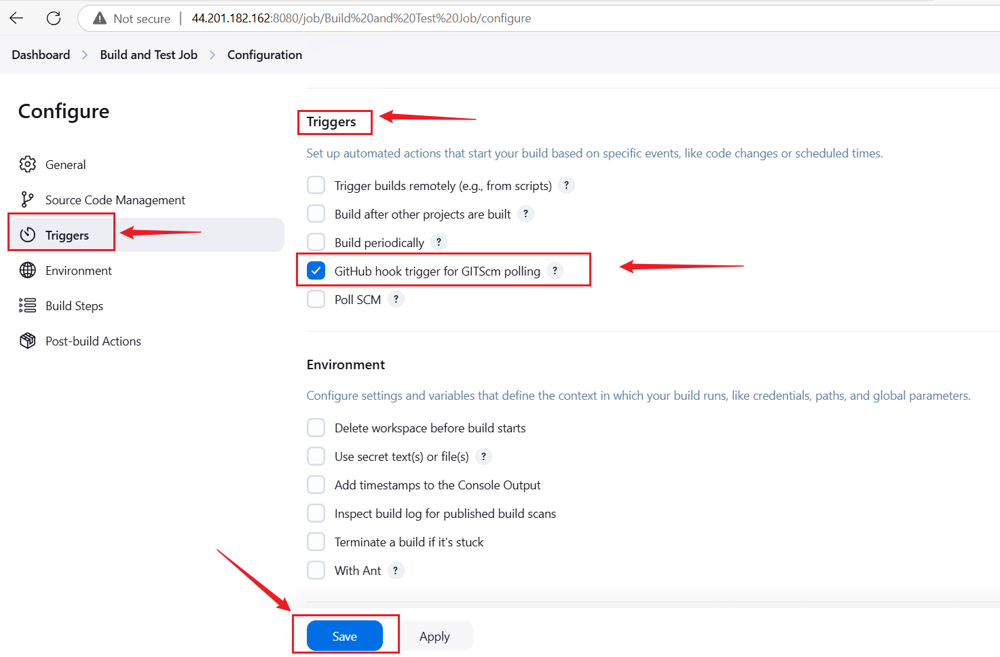

5. Under Build Steps, select Execute Shell and add commands:

```
echo "Building Application..."
# Add your build and test commands here, e.g., for Node.js:
# npm install
# npm run build
# npm test
```


## 3.2 Save and Build:
Click Save and Build Now.
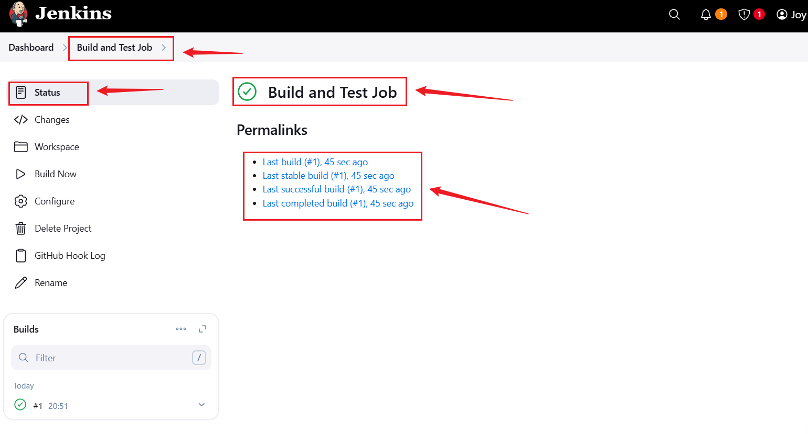

+ Console Output
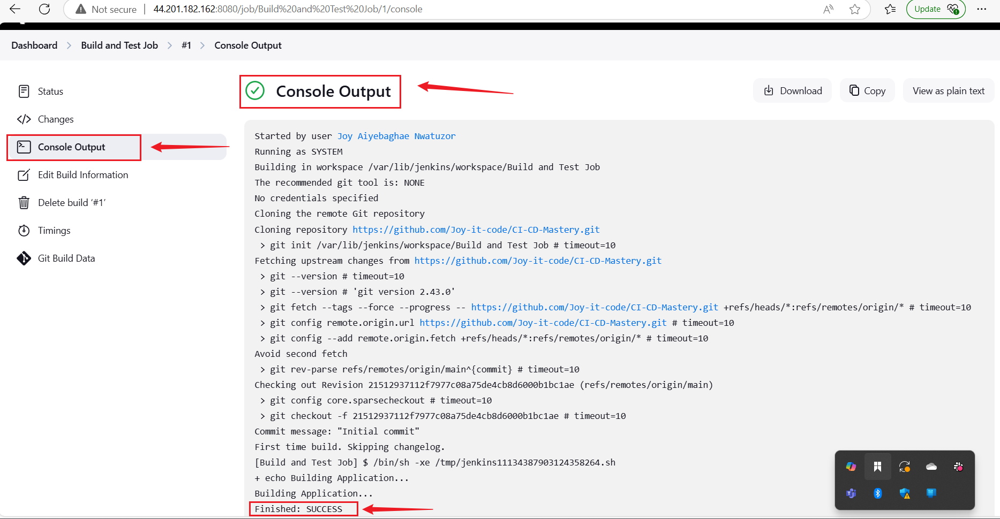


## Step 4. Jenkins Pipeline for Web Application

+ Objective: Develop a Jenkins Pipeline for running a web application.

+ Instructions:

## Step 4: Jenkins Pipeline for Web Application, Docker Image Creation & Registry Push.

### Step 4.1: Create a Simple Web Application (index.html)

```
<!DOCTYPE html>
<html lang="en">
<head>
    <meta charset="UTF-8">
    <meta name="viewport" content="width=device-width, initial-scale=1.0">
    <title>Simple Web Application</title>
</head>
<body>
    <h1>Welcome to My Simple Web Application</h1>
    <p>This is a sample web application for a Jenkins CI/CD Pipeline Capstone Project.</p>
</body>
</html>
```

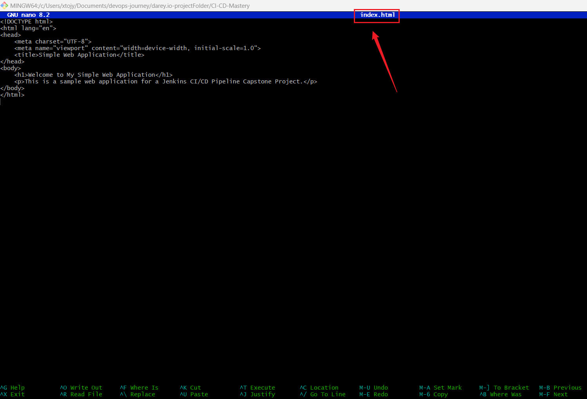

### 4.2: Create a Dockerfile

+ In the same directory as your index.html file, create a file named Dockerfile with the following content:

```
FROM nginx:alpine
COPY index.html /usr/share/nginx/html/
EXPOSE 80
```


### Run the following Git commands in your project directory:

```
git init
git add .
git commit -m "Initial commit - Simple web application"
git branch -M main
git remote add origin https://github.com/Joy-it-code/CI-CD-Mastery.git
git push -u origin main
```


Create a Pipeline Job in Jenkins:

+ Go to Jenkins Dashboard → New Item → Pipeline.
+ Name it Web Application Pipeline, then click ok.
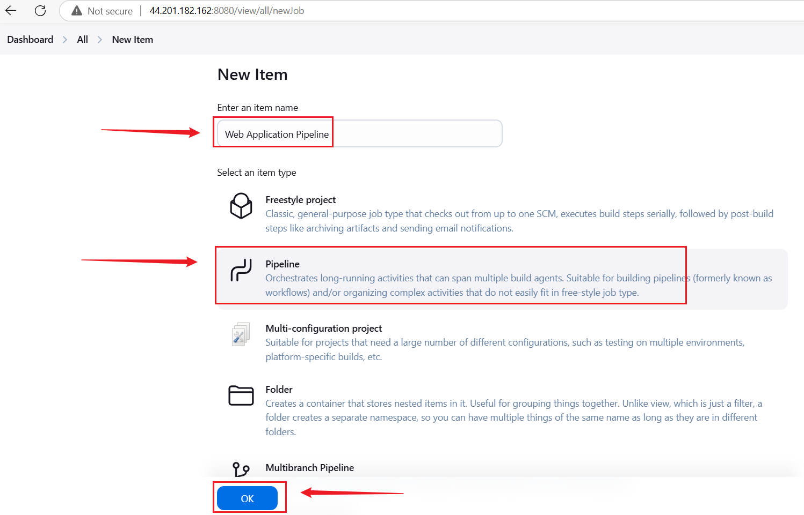

+ Under Pipeline, select Pipeline script from SCM.
+ SCM: Git → Provide repository URL.
+ Script Path: Jenkinsfile.
+ Save and Build.


Jenkins file


