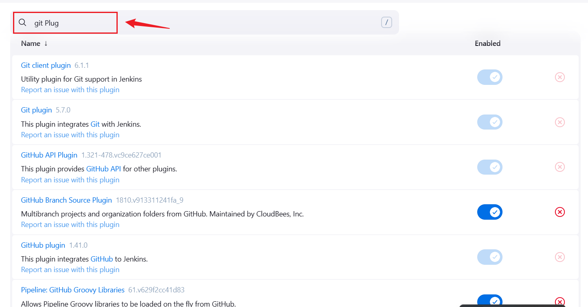
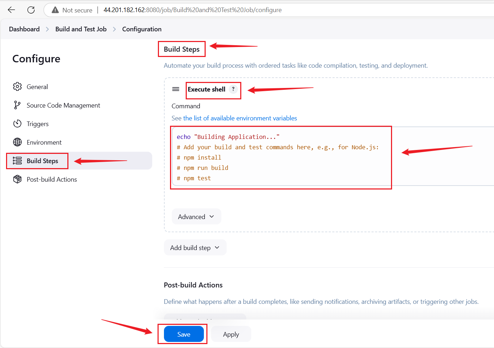
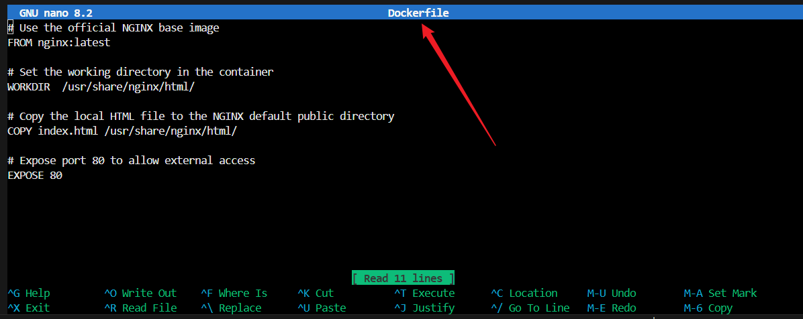
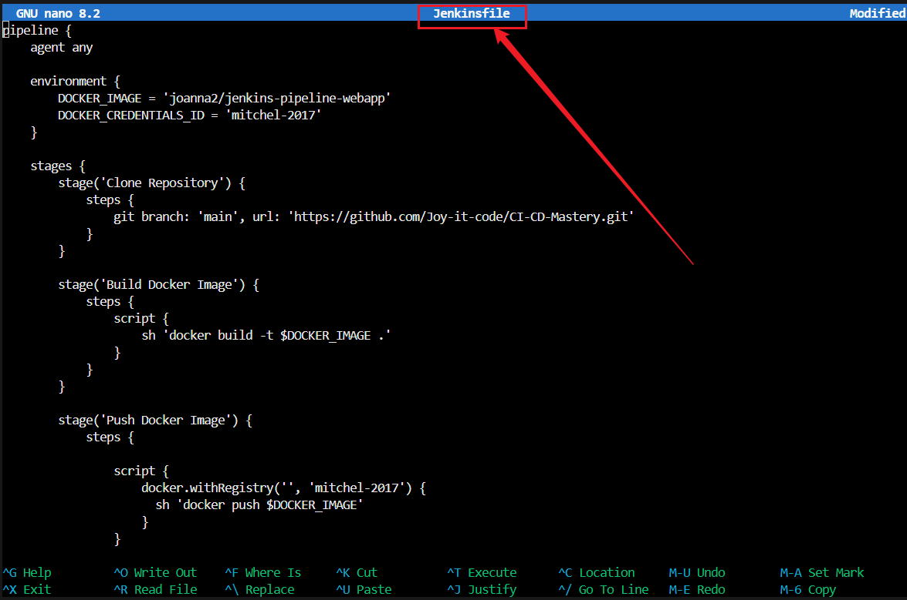
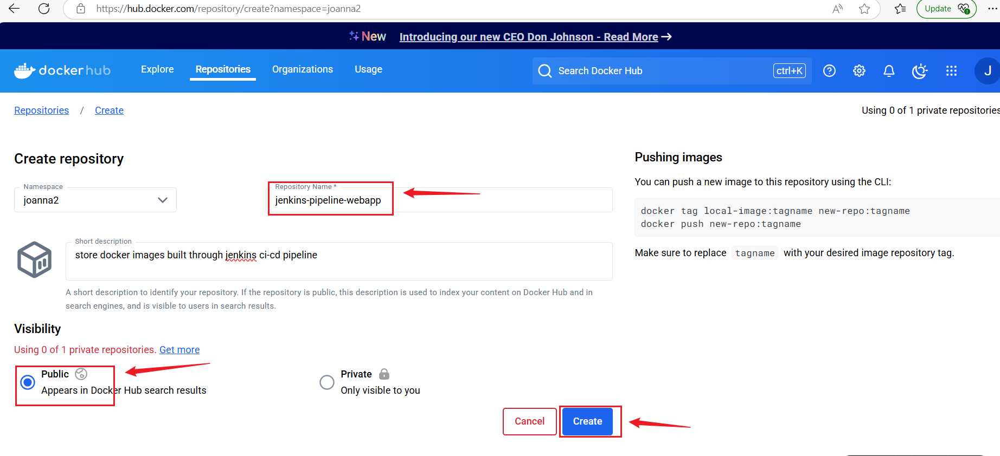

# CI-CD-Mastery

## Introduction

This project focuses on implementing a CI/CD pipeline to automate the deployment of an e-commerce website. Using Jenkin to ensures continuous integration, continuous deployment, scalability, and reliability of the application. The goal is to simplify the deployment process and enhance the efficiency of software delivery.

## Project Instruction

A technology consulting firm is transitioning to cloud-based architecture for its applications. As a **DevOps Engineer**,I have been assign to design and implement a CI/CD pipeline using Jenkins to automate the deployment process. This includes integrating version control, building, testing, and deploying the application like **Jenkins, Docker, Github,AWS EC2 and Bash Scripting** while ensuring scalability and reliability.

**Note:** For this project, I am using Git Bash on a Windows workstation to execute these shell commands, as it provides a Unix-like command-line experience.

## Project Setup

## Step 1: Jenkins server installation

### Objective: Configure Jenkins for CI/CD automation.

### Step 1.1: Run each of this command

**Update and install Java and Jenkins**
```
sudo apt update
sudo apt install openjdk-17-jdk -y
java -version
wget -q -O - https://pkg.jenkins.io/debian-stable/jenkins.io.key | sudo apt-key add -
sudo sh -c 'echo deb http://pkg.jenkins.io/debian-stable binary/ > /etc/apt/sources.list.d/jenkins.list'
sudo apt update
sudo apt install jenkins -y
```

**start and check Jenkins status**
```
sudo systemctl start jenkins
sudo systemctl status jenkins
```


### Step 1.2: Access Jenkins

**Initial Admin Password**


**Installed Suggested Plugins**


**Created First Admin Credentials**


**Jenkins Dashbord**


### Security Measures Were Put In Place: 

+ Install plugins like Role-based Authorization Strategy for access control.
+ Set up firewall rules properly (avoid open ports to the world).
+ Enable authentication for builds.


## Step 2: Source Code Management Repository Integration

+ Install Git Plugin


+ Install Docker


## Step 2: Create Repository on Github

+ Create a repository on Github and name it **CI/CD-Mastery**

+ Initialize it with a README.md file.


### Step 2.1:Install Git On EC2 instance

**Command**
```
sudo apt install -y git
```


 + Clone the Repository to Your Local Machine

**Command:**
```
git clone https://github.com/Joy-it-code/CI-CD-Mastery.git
```


+ Configure Webhook in Github to trigger an automatic build.


## Step 3: Jenkins Freestyle Jobs for Build and Unit Tests

### Objective: Create a Jenkins Freestyle job for building the application and running unit tests.

**Instructions:**
  
+ Login to Jenkins → New Item → Freestyle Project.
+ Name it **Build and Test Job**.


+ Select **Git** under **Source Code Management** and provide the repository URL.
```
https://github.com/Joy-it-code/CI-CD-Mastery.git
```


+ Under trigger, enable trigger for GITScm polling.


+ Under Build Steps, select Execute Shell and add commands:

```
echo "Building Application..."
# Add your build and test commands here, e.g., for Node.js:
# npm install
# npm run build
# npm test
```



## 3.1: Save and Build:
Click Save and Build Now.


+ Console Output


## Step 4. Jenkins Pipeline for Web Application

+ Objective: Develop a Jenkins Pipeline, index.html and Dockerfile for running a web application.

+ Instructions: Develop Jenkins Pipeline for Web Application, Docker Image Creation & Registry Push.

### Step 4.1: Create a Simple Web Application (index.html)

```
<!DOCTYPE html>
<html lang="en">
<head>
    <meta charset="UTF-8">
    <meta name="viewport" content="width=device-width, initial-scale=1.0">
    <title>Simple Web Application</title>
</head>
<body>
    <h1>Welcome to My Simple Web Application</h1>
    <p>This is a sample web application for a Jenkins CI/CD Pipeline Capstone Project.</p>
</body>
</html>
```


### 4.2: Create a Dockerfile

+ In the same directory as your index.html file, create a file named Dockerfile and jenkinsfile with the following content:

```
# Use the official NGINX base image
FROM nginx:latest

# Set the working directory in the container
WORKDIR  /usr/share/nginx/html/

# Copy the local HTML file to the NGINX default public directory
COPY index.html /usr/share/nginx/html/

# Expose port 80 to allow external access
EXPOSE 80
```


### Step 4.3: Create a Jenkinsfile

```
pipeline {
    agent any

    environment {
        DOCKER_IMAGE = 'joanna2/jenkins-pipeline-webapp'
        DOCKER_CREDENTIALS_ID = 'mitchel-2017'
    }

    stages {
        stage('Clone Repository') {
            steps {
                git branch: 'main', url: 'https://github.com/Joy-it-code/CI-CD-Mastery.git'
            }
        }

        stage('Build Docker Image') {
            steps {
                script {
                    sh 'docker build -t $DOCKER_IMAGE .'
                }
            }
        }

        stage('Push Docker Image') {
            steps {
                
                script {
                    docker.withRegistry('', 'mitchel-2017') {
                      sh 'docker push $DOCKER_IMAGE'
                    }
                }
 
            }
        }

        stage('Deploy Container Locally') {
            steps {
                sh 'docker run -d -p 8090:80 $DOCKER_IMAGE'
            }
        }
    }

    post {
        success {
            echo 'Pipeline completed successfully.'
        }
        failure {
            echo 'Pipeline failed.'
        }
    }
}
```


### Step 4.4: Push Your Code to GitHub

### Run the following Git commands in your project directory:

```
git add .
git commit -m "Initial commit - Simple web application"
git push origin main
```

## Step 5: Set Up Jenkins Pipeline to Build Docker Image

### Objective: Automate Docker image creation and push to a container registry like Docker Hub.

+ Install Docker on Your EC2 Instance:

```
sudo apt update
sudo apt install docker.io -y
sudo usermod -aG docker $USER
newgrp docker
docker --version
```
+ Enable Docker to start on boot:

```
sudo systemctl enable docker
sudo systemctl start docker
```

+ Add Jenkins User to Docker Group:

```
sudo usermod -aG docker jenkins
sudo systemctl restart jenkins
```

### Step 5.2: Docker Image Creation and Push to Dockerhub

+ Log into Dockerhub, visit htttps://hub.docker.com/

+ Create a New Repository

+ Click Create Repository.

+ Repository Name: jenkins-pipeline/webapp.

+ Visibily: Public

+ Click Create.



### Setup DOCKER_CREDENTIAL_ID

+ In your Dockerhub, Go up to your name,
+ Click on account settings
+ Click on security
+ Click new access tokens, and name it 
+ Click create
+ Copy the generated token and save

### Log into Jenkins instance

+ click on Manage Jenkins
+ Click Manage Credentials.
+ Under Stores scoped to Jenkins, click (global) or Global
credentials (unrestricted).
+ Click Add Credentials.
+ In the Add Credentials form, fill in the fields
+ Click OK to save.


## Step 5.3: Create a Pipeline Job in Jenkins:

### Objective:

+ Go to Jenkins Dashboard → New Item → Pipeline.
+ Name it Web Application Pipeline, then click ok.


+ Under Pipeline, select Pipeline script from SCM.


+ SCM: Git → Provide repository URL.
+ Script Path: Jenkinsfile.


+ Save and click Build now to run the pipeline.


## Step 5.4: Access the Web Application

After the pipeline deploys your container:

+ Open your browser.

+ Visit http://44.201.182.162:8090


## Step 5.5: Push Docker Image to Docker Hub

+ Visit dockerhub to see the image


+ Docker image on EC2 


## Commit and Push changes to Github repository.

**Command**

```
git add .
git commit -m "updated file"
git push
```

### Expected Outcome:

+ Successful automation of the Docker image creation, pushing it to Docker Hub, and deploying the container locally. 

+ I Accessed my web application through http://44.201.182.162:8090 to confirm deployment.


### Key Achievements:

+ Automated end-to-end CI/CD pipeline for containerized web applications.

+ Seamless Docker image build, push to Docker Hub, and local deployment.

+ I Ensured consistent and repeatable application delivery using Jenkins.


### Conclusion:

This pipeline streamlines the development lifecycle by integrating Docker and Jenkins, enabling fast, reliable, and automated deployment of containerized applications.

## Author

**Joy** – *Striving DevOps Engineer*

### 🔗 GitHub Repository: Joy-it-code/CI-CD-Mastery 

 **🌟 Delighted Acquiring 🚀** 